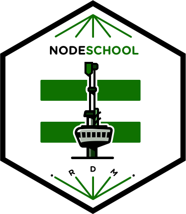

# NodeSchool Rotterdam

Repository for organising Rotterdam NodeSchool events. NodeSchool Rotterdam is hosted at Pixelbar.

## Team

- [David van Leeuwen](https://github.com/davidvanleeuwen)
- [Tiemen Waterreus](https://github.com/Tmw)
- [Timon van Spronsen](https://github.com/TimonVS)
- [John van de Water](https://github.com/jchn)

## Links

- [Meetup group](https://www.meetup.com/nl-NL/nodeschool-rotterdam/)
- [Pixelbar hackerspace](https://www.pixelbar.nl)
